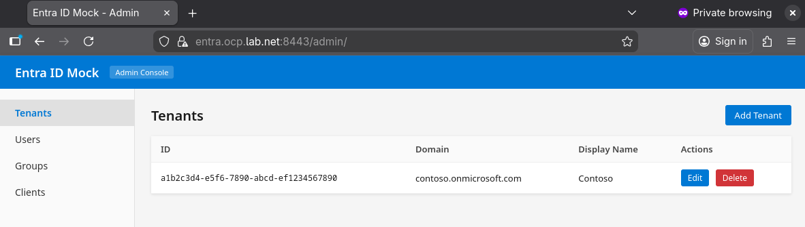

# entra-id-emulator

A lightweight Entra ID (Azure AD) emulator for local development and testing. Provides OIDC/OAuth2 endpoints, token issuance, and a management API.



## Features

- **OIDC/OAuth2 endpoints** — discovery, authorize, token, JWKS, userinfo, logout
- **Multiple grant types** — authorization code (with PKCE), refresh token, resource owner password
- **Hybrid flow** — `code id_token` and `id_token token` response types
- **Pairwise subject identifiers** — per-tenant, per-client `sub` claims
- **Groups claim** — with overage handling (>200 groups)
- **Token lifetime overrides** — per-tenant and per-client, with cascading defaults
- **Admin REST API** — full CRUD for tenants, users, groups, and clients
- **Admin web UI** — at `/admin/`
- **SQLite storage** — zero external dependencies
- **Configurable via YAML** — seed tenants, users, groups, and clients on startup

## Quick Start

```bash
pip install -r requirements.txt
python run.py
```

The server starts on `http://localhost:8080`. Configuration is loaded from `config.yaml`.

### With Docker/Podman

See `examples/` for compose files. For example, with podman:

```bash
cp examples/podman-compose.yml .
podman-compose up --build
```

## Configuration

Edit `config.yaml` to define the server, tenants, users, clients, and token lifetimes:

```yaml
server:
  host: "0.0.0.0"
  port: 8080
  scheme: "http"
  external_hostname: "localhost:8080"

token_lifetimes:
  access_token_seconds: 3600
  id_token_seconds: 3600
  refresh_token_days: 90
  auth_code_seconds: 60

tenants:
  - id: "a1b2c3d4-e5f6-7890-abcd-ef1234567890"
    domain: "contoso.onmicrosoft.com"
    display_name: "Contoso"

users:
  - id: "00000000-0000-0000-0000-000000000001"
    tenant_id: "a1b2c3d4-e5f6-7890-abcd-ef1234567890"
    upn: "admin@contoso.onmicrosoft.com"
    email: "admin@contoso.com"
    display_name: "Admin User"
    given_name: "Admin"
    family_name: "User"
    password: "changeme"
    groups:
      - id: "g1g1g1g1-g1g1-g1g1-g1g1-g1g1g1g1g1g1"
        name: "Admins"

clients:
  - client_id: "11111111-2222-3333-4444-555555555555"
    tenant_id: "a1b2c3d4-e5f6-7890-abcd-ef1234567890"
    display_name: "OAuth2 Proxy"
    client_secret: "my-client-secret"
    client_type: "confidential"
    redirect_uris:
      - "http://localhost:4180/oauth2/callback"
    allowed_scopes:
      - "openid"
      - "profile"
      - "email"
      - "offline_access"
```

Override the config path with `ENTRA_MOCK_CONFIG` env var. The SQLite database path defaults to `data/entra_mock.db` (override with `ENTRA_MOCK_DB`).

## OIDC Endpoints

| Endpoint | URL |
|----------|-----|
| Discovery | `GET /{tenant}/v2.0/.well-known/openid-configuration` |
| Authorize | `GET/POST /{tenant}/oauth2/v2.0/authorize` |
| Token | `POST /{tenant}/oauth2/v2.0/token` |
| JWKS | `GET /{tenant}/discovery/v2.0/keys` |
| UserInfo | `GET/POST /oidc/userinfo` |
| Logout | `GET/POST /{tenant}/oauth2/v2.0/logout` |

`{tenant}` can be a tenant UUID, domain name, or the aliases `common`/`organizations`.

## Admin API

Full CRUD for tenants, users, groups, and clients at `/admin/api/`. See [API-USAGE.md](API-USAGE.md) for complete documentation with `curl` examples.

### Quick example — get a token

```bash
# Using the default seed data
curl -s -X POST http://localhost:8080/a1b2c3d4-e5f6-7890-abcd-ef1234567890/oauth2/v2.0/token \
  -d "grant_type=password" \
  -d "client_id=11111111-2222-3333-4444-555555555555" \
  -d "client_secret=my-client-secret" \
  -d "username=admin@contoso.onmicrosoft.com" \
  -d "password=changeme" \
  -d "scope=openid profile email"
```

## Project Structure

```
├── entra_mock/          # Flask application
│   ├── routes/          # OIDC + admin API endpoints
│   ├── templates/       # Login, logout, admin UI, error pages
│   ├── app.py           # App factory
│   ├── config.py        # YAML config loader
│   ├── db.py            # SQLite schema, migrations, queries
│   ├── keys.py          # RSA signing key management
│   └── tokens.py        # JWT token generation
├── examples/            # Docker/Podman compose files, oauth2-proxy config
├── notes/               # Design specs and implementation notes
├── config.yaml          # Default configuration with seed data
├── run.py               # Entry point
├── Dockerfile
└── requirements.txt
```

## License

MIT
